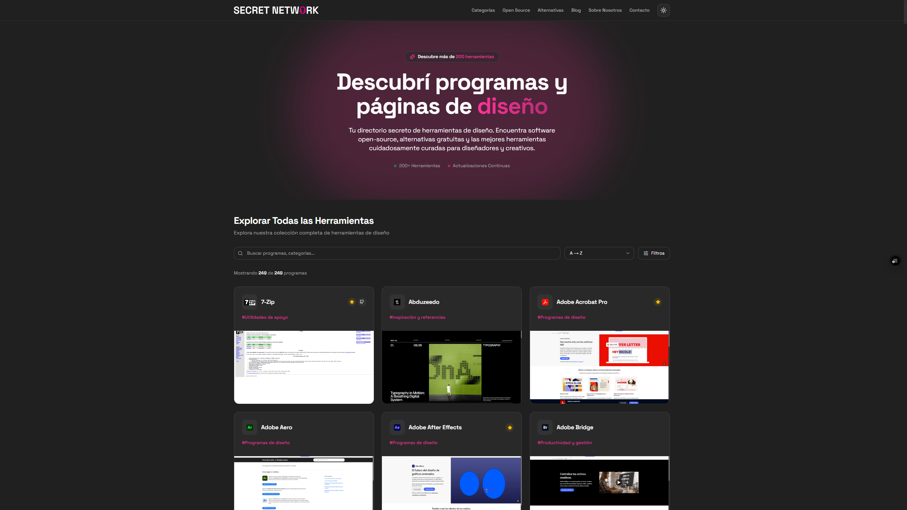
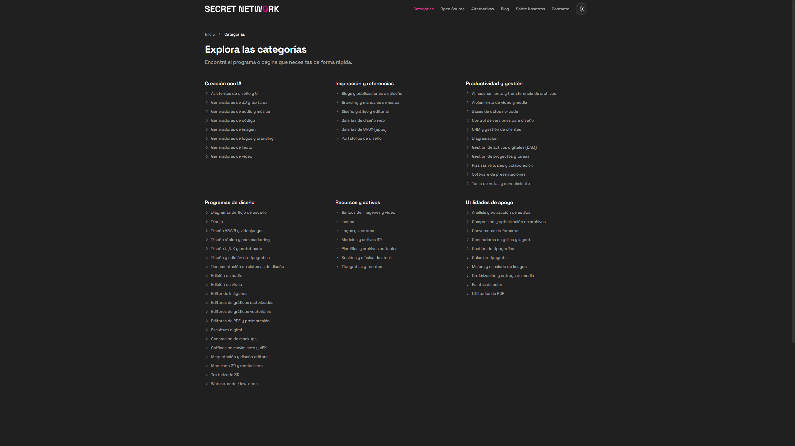

# Secret Network

**Descubre herramientas y programas de diseño. Encuentra alternativas gratuitas y open source.**

[Visitar sitio web](https://secretnetwork.co) · [Reportar un error](https://secretnetwork.co/contacto) · [Sugerir herramienta](https://secretnetwork.co/contacto)

---

## Sobre este proyecto

Secret Network es un directorio completo de herramientas y programas de diseño, con un enfoque especial en alternativas gratuitas y open source.

Nuestro objetivo es ser tu primera parada cuando buscas una nueva herramienta para tus proyectos creativos. Te ayudamos a encontrar alternativas a los programas que ya usás, descubrir nuevas opciones y explorar el mundo del software libre.



---

## Características principales

- 🎨 **200+ herramientas** categorizadas por tipo (diseño UI/UX, edición de imágenes, vectores, etc.)
- 🔍 **Búsqueda y filtros avanzados** por categoría, subcategoría, modelo de precio y dificultad
- �  **Alternativas gratuitas** a software propietario popular (Photoshop, Illustrator, Figma, etc.)
- 📝 **Blog integrado** con artículos sobre diseño y herramientas
- 🌐 **Sección Open Source** dedicada a software libre
- 📱 **Totalmente responsive** con modo oscuro
- ⚡ **Performance optimizada** con Next.js 15 y ISR



---

## Servicios utilizados

Secret Network utiliza los siguientes servicios de terceros:

- **Base de datos**: [Supabase](https://supabase.com) (PostgreSQL)
- **Analytics**: [Google Analytics 4](https://analytics.google.com), [Google Tag Manager](https://tagmanager.google.com)
- **Imágenes**: [Cloudinary](https://cloudinary.com), [Unsplash](https://unsplash.com)
- **Emails**: [Resend](https://resend.com)
- **Hosting**: [Vercel](https://vercel.com)
- **DNS**: [Cloudflare](https://cloudflare.com)

Asegurate de configurar cuentas con estos servicios y agregar las variables de entorno necesarias a tu archivo `.env.local`.

---

## Estructura del proyecto

Secret Network está construido con Next.js App Router. La estructura del proyecto está organizada de la siguiente manera:

```
/app                    - Rutas y layouts de la aplicación (Next.js App Router)
  /admin                - Panel de administración
  /api                  - API routes (contacto, etc.)
  /blog                 - Blog posts
  /categorias           - Páginas de categorías
  /programas            - Páginas de programas individuales
  /alternativas         - Páginas de alternativas
/components             - Componentes React reutilizables
  /admin                - Componentes del panel de admin
  /blog                 - Componentes del blog
  /layout               - Header, Footer, Navbar
  /shared               - Componentes compartidos
  /seo                  - Componentes de SEO (JSON-LD)
/lib                    - Utilidades y lógica de negocio
  /supabase.ts          - Cliente de Supabase
  /types.ts             - Definiciones de tipos TypeScript
  /utils.ts             - Funciones auxiliares
/public                 - Assets estáticos
/scripts                - Scripts de utilidad (seed, etc.)
```

---

## Desarrollo

Este proyecto usa **npm** como gestor de paquetes. Asegurate de tener Node.js 18+ instalado.

### Configuración inicial

1. **Clonar el repositorio**

```bash
git clone https://github.com/LucasSabena/secret-network.git
cd secret-network
```

2. **Instalar dependencias**

```bash
npm install
```

3. **Configurar variables de entorno**

Copia el archivo `.env.example` a `.env.local` y actualiza las variables:

```bash
cp .env.example .env.local
```

Edita `.env.local` con tus credenciales:

```env
# Supabase
NEXT_PUBLIC_SUPABASE_URL=tu_url_de_supabase
NEXT_PUBLIC_SUPABASE_ANON_KEY=tu_anon_key
SUPABASE_SERVICE_ROLE_KEY=tu_service_role_key

# Cloudinary
NEXT_PUBLIC_CLOUDINARY_CLOUD_NAME=tu_cloud_name
CLOUDINARY_API_KEY=tu_api_key
CLOUDINARY_API_SECRET=tu_api_secret
NEXT_PUBLIC_CLOUDINARY_UPLOAD_PRESET=tu_preset

# Analytics
NEXT_PUBLIC_GA_MEASUREMENT_ID=G-XXXXXXXXXX
NEXT_PUBLIC_GTM_ID=GTM-XXXXXXX

# Site
NEXT_PUBLIC_SITE_URL=https://secretnetwork.co

# Email
RESEND_API_KEY=tu_resend_api_key
```

4. **Ejecutar en desarrollo**

```bash
npm run dev
```

Abre [http://localhost:3000](http://localhost:3000) en tu navegador.

---

## 🧞 Comandos

Todos los comandos se ejecutan desde la raíz del proyecto:

| Comando              | Acción                                      |
| -------------------- | ------------------------------------------- |
| `npm install`        | Instala las dependencias                    |
| `npm run dev`        | Inicia el servidor de desarrollo           |
| `npm run build`      | Construye la aplicación para producción    |
| `npm run start`      | Previsualiza la build de producción        |
| `npm run lint`       | Ejecuta el linter                           |
| `npm run type-check` | Verifica los tipos de TypeScript            |

---

## Deployment

El proyecto está configurado para deployment en **Vercel**. Para deployar manualmente:

1. Construye el proyecto: `npm run build`
2. Inicia el servidor de producción: `npm run start`
3. Asegurate de que todas las variables de entorno estén configuradas en tu entorno de producción

Para deployment automático, conecta tu repositorio de GitHub a Vercel y cada push a `main` se deployará automáticamente.

---

## Contribuir

Las contribuciones son bienvenidas. Si querés agregar una herramienta, reportar un error o sugerir una mejora:

1. Usá el [formulario de contacto](https://secretnetwork.co/contacto)
2. Abrí un [issue en GitHub](https://github.com/LucasSabena/secret-network/issues)
3. Enviá un pull request

---

## Licencia

Este proyecto es de código cerrado. Todos los derechos reservados.

---

## Autor

**Lucas Sabena**

- GitHub: [@LucasSabena](https://github.com/LucasSabena)
- Email: 01studiobinary@gmail.com

---

**Desarrollado con ❤️ por Binary Studio**

⭐ Dale una estrella si te gusta el proyecto!
